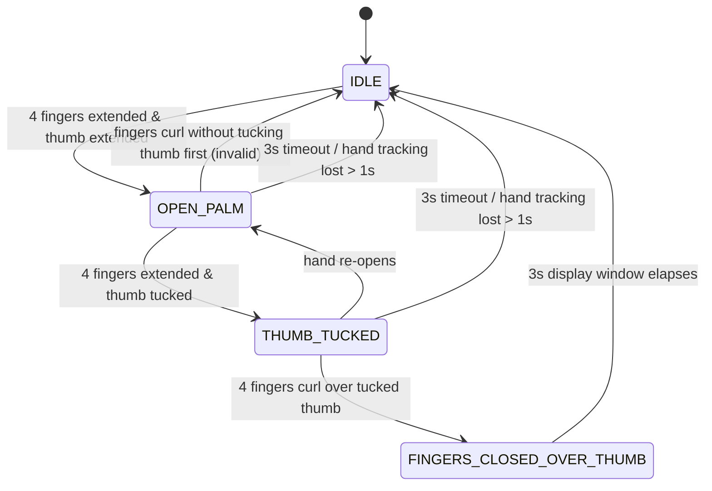
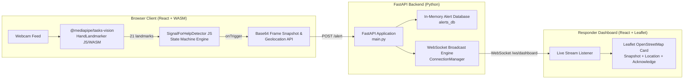

# 🖐️ SOS Sign — Silent Emergency Gesture Detection Web App

**Real-time, client-side computer vision system that silently recognizes the "Signal for Help" hand gesture via webcam inside a disguised video call interface and broadcasts live emergency alerts with geolocation to responders.**

<p align="center">
  
  
  
  
  
  
  
</p>

<p align="center">
  
  <br><sub>Replace with screen-captured demo GIF showing disguised UI trigger to live dashboard alert flow.</sub>
</p>

---

## 📌 The Problem & Solution

Originally created by the **Canadian Women's Foundation** (2020) for individuals experiencing domestic violence or coercive control, the single-handed **Signal for Help** allows victims to discreetly communicate "I need help" on camera without speaking aloud or alerting an abuser. Whether used by domestic violence survivors, vulnerable seniors facing elder abuse, children in coercive households, stalking victims of any gender, or individuals experiencing workplace harassment — the same silent trigger works for anyone who cannot safely speak up.

**SOS Sign** brings automated computer vision to this safety mechanism. Running 100% client-side inside WebAssembly, it continuously tracks hand gestures underneath an innocent video call interface without sending raw video streams over the network. When the full gesture sequence is detected, it captures a video snapshot, fetches geolocation coordinates, and broadcasts an emergency alert to a live responder dashboard over WebSockets.

---

## 🎬 How the Gesture Works

```
[ 1. Open Palm ]  ──>  [ 2. Thumb Tucked ]  ──>  [ 3. Fingers Closed Over Thumb ]
 (Fingers & Thumb)       (Thumb inside palm,       (Fist with thumb trapped inside)
    Extended                Fingers open)
```

The gesture engine enforces a strict 3-stage finite state machine (`IDLE → OPEN_PALM → THUMB_TUCKED → TRIGGERED`):

1. **Open Palm**: Palm faces the camera with 4 fingers extended and thumb open.
2. **Thumb Tucked**: Thumb folds inward across the palm while 4 fingers remain extended.
3. **Fingers Closed Over Thumb**: Four fingers fold down over the tucked thumb, trapping it in a fist.



### Geometric Pose Telemetry & Ratios

Landmark coordinates are scale-normalized using palm size ($\text{Wrist [0]} \to \text{Middle MCP [9]}$ distance) to ensure resilience against hand size and distance from the camera:

* **Finger Extension Ratio ($0.85$)**: A finger is extended when $\text{Tip}_y < \text{PIP}_y$ and $\text{dist}(\text{MCP}, \text{Tip}) > 0.85 \times \text{dist}(\text{MCP}, \text{PIP})$. (`four_fingers_extended` requires $\ge 3$ fingers).
* **Finger Curl Ratio ($1.1$)**: A finger is curled when $\text{Tip}_y > \text{PIP}_y$ or $\text{dist}(\text{MCP}, \text{Tip}) < 1.1 \times \text{dist}(\text{MCP}, \text{PIP})$. (`four_fingers_curled` requires $\ge 3$ fingers).
* **Thumb Tuck Ratios ($0.60$ / $0.40$)**: Thumb is tucked when $\frac{\text{dist}(\text{ThumbTip}, \text{PinkyMCP})}{\text{palm\_size}} < 0.60$ OR $\frac{\text{dist}(\text{ThumbTip}, \text{MiddleMCP})}{\text{palm\_size}} < 0.40$.
* **Thumb Extension Ratio ($0.70$)**: Thumb is extended when $\frac{\text{dist}(\text{ThumbTip}, \text{PinkyMCP})}{\text{palm\_size}} > 0.70$ and not tucked.
* **Sequence Window ($3.0\text{s}$)**: The entire 3-stage sequence must complete within 3.0 seconds. Closing a fist directly without tucking the thumb first immediately resets the state machine to suppress false alarms.

---

## 🏗️ System Architecture



---

## 🛠️ Verified Tech Stack

| Domain | Technology | Version | Purpose |
|---|---|---|---|
| **Frontend Core** | React | `19.2.8` | UI Component Framework |
| **Build System** | Vite | `8.2.0` | Frontend Tooling & Dev Server |
| **Styling** | Tailwind CSS | `4.3.3` | Utility-First Styling System |
| **Routing** | React Router DOM | `7.18.2` | Single-Page App Navigation |
| **Vision Inference** | `@mediapipe/tasks-vision` | `1.0.1` | WebAssembly Hand Landmark Tracking |
| **Mapping** | Leaflet & React-Leaflet | `1.9.4` / `5.0.0` | OpenStreetMap Interactive Emergency Maps |
| **Icons** | Lucide React | `1.30.0` | UI Icons |
| **Backend API** | FastAPI | `0.116.0` | Python REST API & WebSocket Server |
| **ASGI Server** | Uvicorn | `0.34.0` | Async Server Implementation |
| **Sockets** | WebSockets | `14.2` | Real-Time Emergency Event Stream |

---

## ⚡ Quickstart (Local Setup)

### Prerequisites
* **Node.js**: v18+ and `npm`
* **Python**: v3.9+ and `pip`
* A connected webcam device

### 1. Launch FastAPI Backend
```bash
cd backend
pip install -r requirements.txt
python -m uvicorn main:app --reload --port 8000
```
> **Backend Health Endpoint**: `http://127.0.0.1:8000/health`

### 2. Launch React Frontend
In a second terminal:
```bash
cd frontend
npm install
npm run dev
```
> **Frontend Application URL**: `http://localhost:5173/`

---

## 🎬 Demo Walkthrough ("Try It Yourself")

1. **Configure Profile & Contacts**:
   - Open **`http://localhost:5173/contacts`**.
   - Input display name (e.g. *"Jane Doe"*) and emergency contact entries. Click **"Save Emergency Contacts"**.
2. **Open Responder Live Monitoring Dashboard**:
   - Open **`http://localhost:5173/dashboard`** in Browser Tab 1.
   - Observe pre-seeded historical alerts and the green **"LIVE STREAM ACTIVE"** WebSocket status badge.
3. **Open Disguised Protection View**:
   - Open **`http://localhost:5173/protect`** in Browser Tab 2.
   - Notice the authentic video conferencing room interface ("Product Engineering Sync") with self-view tile, ticking call duration timer, and participant grid.
4. **Trigger Silent Distress Signal**:
   - In Tab 2, perform the 3-step gesture facing the webcam: **Open Palm $\to$ Tuck Thumb $\to$ Fold 4 Fingers Over Thumb**.
   - Observe the confirmation pop-over: *"Emergency alert dispatched live to Dashboard! Notification sent: Jane Doe, Campus Security"*.
5. **Observe Live Responder Broadcast**:
   - Switch back to Tab 1 (`/dashboard`).
   - The new alert card arrives in real-time over WebSockets with the Base64 camera snapshot, interactive Leaflet OpenStreetMap location marker, timestamp, and **"Acknowledge Alert"** button.

---

## 🏆 Foundation & Python Prototype Attribution

This project is built upon the validated algorithms of [/signal-for-help-detector](file:///d:/SOS_sign_detector/signal-for-help-detector/), a standalone Python computer vision system built with OpenCV and MediaPipe Python that won the **Soft Model Competition (2026)**.

The Python prototype proved the geometric ratios, scale normalization formulas, and false-positive suppression rules. This web application ports those exact mathematical formulas line-by-line into client-side JavaScript WebAssembly ([signalForHelpDetector.js](file:///d:/SOS_sign_detector/frontend/src/lib/signalForHelpDetector.js)) to eliminate server latency and preserve camera privacy.

---

## ⚠️ Known Limitations & Future Roadmap

### Current MVP Boundaries
* **In-Memory Backend Storage**: Alert history (`alerts_db`) and contact entries (`contacts_db`) are stored in FastAPI memory for lightweight demo execution. Data resets on server restart.
* **Simulated Carrier Dispatch**: Emergency notifications to contacts are displayed via animated client toasts and broadcasted live to the WebSocket dashboard; direct Twilio SMS/voice carrier integration is not wired up yet.
* **Single-Hand Tracking**: Gesture recognition evaluates one hand per video frame (`num_hands = 1`).
* **Single Disguise Cover**: Disguised UI currently features a video conferencing cover screen.

### Planned Production Improvements
* **Persistent Database Integration**: Replace in-memory storage with PostgreSQL and Redis.
* **Twilio & AWS SNS Integration**: Dispatch real SMS text alerts and automated emergency voice calls to carrier phone numbers.
* **Multi-Theme Cover Selector**: Allow users to toggle between multiple disguised cover themes (e.g. online calculator, weather forecast app, news reader).
* **Multi-Hand & Morphological Training**: Expand classifier models to support atypical digit counts, prosthetics, and multi-person camera frames.

---

## 📜 License & Acknowledgements

Released under the [MIT License](LICENSE).

### Credits & Attribution
The **Signal for Help** gesture was created by the **Canadian Women's Foundation** (launched April 14, 2020) and supported globally by the **Women's Funding Network (WFN)** to combat home violence and abuse.

- **Canadian Women's Foundation**: [canadianwomen.org](https://canadianwomen.org)
- **Women's Funding Network**: [womensfundingnetwork.org](https://www.womensfundingnetwork.org)
- **MediaPipe**: [developers.google.com/mediapipe](https://developers.google.com/mediapipe)
- **OpenStreetMap & Leaflet**: [openstreetmap.org](https://www.openstreetmap.org)